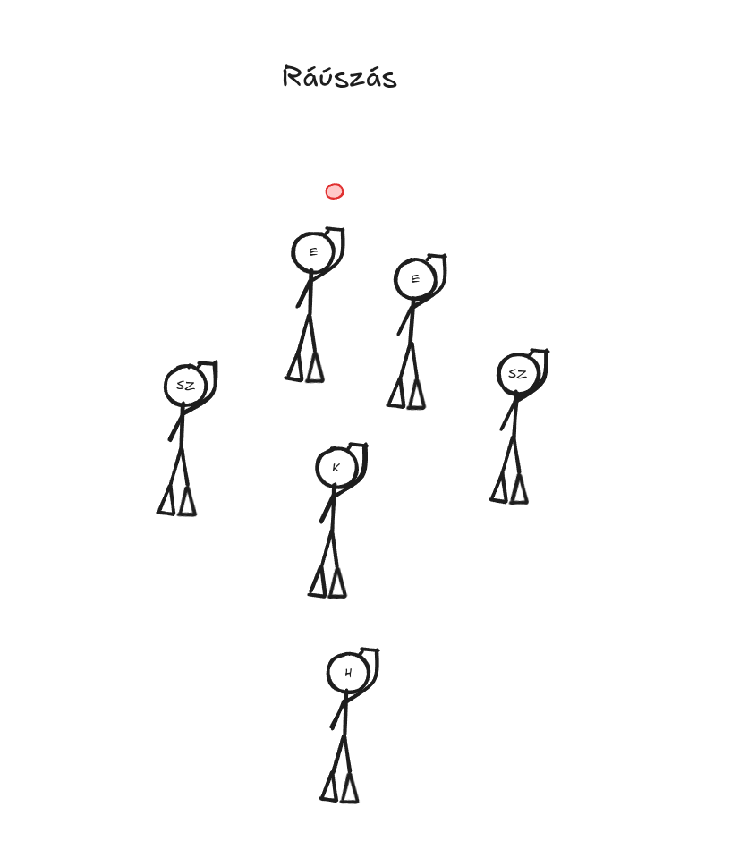
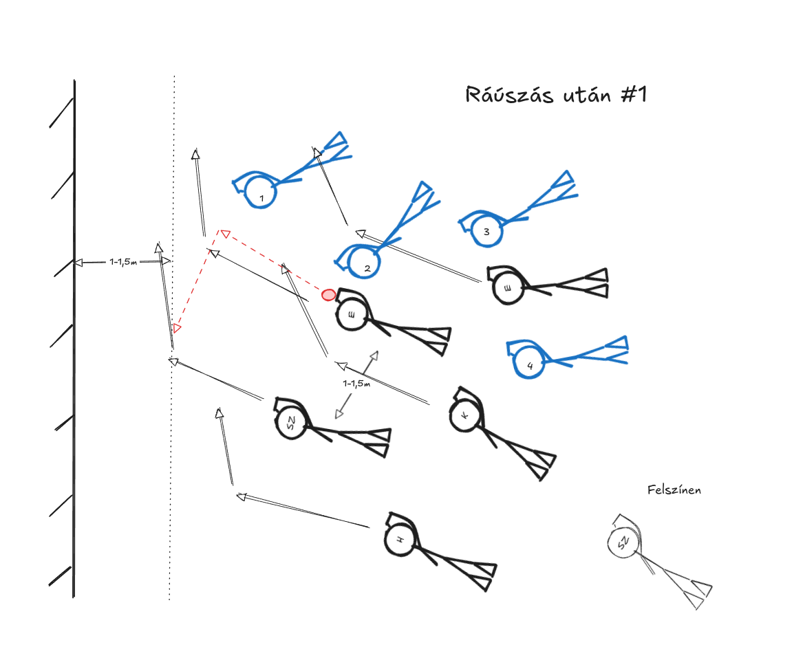

# A magyar 2-3-1

Három bejegyzésben szeretném áttekinteni a 2-3-1-ünket felépítő pozíciókat és azt, hogy a saját rendszerünkben milyen elvárásokat támasztunk eléjük.
Ezeket az elvárásokat igyekszem majd megindokolni és lehetőség szerint példát is mutatni a jó kivitelezésükre, illetve rámutatni, hogy milyen problémát okozhat a figyelmen kívűl hagyásuk.

## A szélső pozícióról általánosan

2-3-1-es felállásban a középső sor szélén lévő két játékost hívjuk bal és jobb szélsőnek.
A pozíció nagyon sokrétű tudást igényel, másodpercek alatt lehet utolsó védőből és góllövő befejező az ember.
Bár a mi rendszerünkben eléggé megkötött a pozíciójuk, de nagyon fontos, hogy ezen belül precízen helyezkedjen a játékos.
Technikailag a legfontosabbak az alapok: fordulás, jobbról és balról szerelés, lövés, passzátvétel - egy aránylag egyszerű repertoárral már nagyon eredményes szélső lehet valaki.
Fizikailag fitnek és gyorsnak kell lenni. A magyar csapattal általában fix cserével (tehát 2 ember cseréli egymást egy pozícióra) játszuk a szélsőt,
így pár percenként megpihenhet a játékos, de a bentlét alatt emiatt sok munkát kell végeznie.

## Aranyszabályok

A szélsők helyezkedését és döntéseit az esetek 99%-ban a következő szabályok határozzák meg:

1. Mindig a korong vonala mögé helyzkedj!
2. Ne kerülj a középső túloldalára!
3. A saját oldalad felé sosem kerülhetnek meg (jobb szélsőt jobbra, balra szélsőt balra ne ússzon körbe ellenfél)!
4. Próbáld az ellenfél szélső emberét kívűlről kerülni - ne törj befelé!
5. Ne irányíts, csak akkor passzolj a szélsőnek és hátsónak, ha látod, hogy kérik a korongot!
6. Ha lehetőséged van (és általában van), akkor vidd a korongot a saját oldalad felé!
7. Ha a tulsó oldalra besegítesz védekezni, akkor
  1. biztosítsd a korongot,
  2. a lehető leggyorsabban (teljes biztonság mellett) add át a hátsónak vagy tulsó szélsőnek,
  3. sprintelj vissza a saját széledre, amilyen gyorsan csak tudsz!

Ha valaki ezeket megjegyzi, akkor a játék közben felmerülő szinte összes szélsőt érintő kérdésre választ kap!

## Szituációk

### Ráúszás

Ráuszáskor a szélsők valamivel az első mögött, 0.5-1 méterre oldalra a középsőtől helyezkednek el.
Arra kell koncentrálniuk, hogy bármerre is megy tovább a korong, a közelben tudjanak maradni és segíteni a csapatnak.
Mivel mindkét csapatból sok ember lent van, így [statikus játékszituációról](#statikus-játékszituáció) beszélhetünk, fontos, hogy amíg nem tisztázódott le a helyzet, addig elég közel legyen ahhoz, hogy játékba tudjanak avatkozni.

[Egy jó példa a szélső kihozatalra](https://youtube.com/clip/UgkxManUw2g3OnkR6l0SkiYl1RvGzL_bAHcn?si=fbLAnucn3kHkSWms) a 2004-es VB elődöntőből. Az első ráúszást követően a szélső visszafordult szinte teljesen a saját kapuja felé és közben úgy helyezkedett a testével, hogy ki tudja "rántani" a korongot középről és rögtön tudjon a saját fala felé úszni vele (ahol egy első már sprintel elé).

#### Korong oldalra megy

3 nagyobb részre bonthatjuk azt az esetet, mikor a korong oldalra indul el:
1. nálunk van és az első tudott vele oldalra úszni,
2. nálunk van és a szélső tud vele úszni,
3. ellenfél hozza ki a szélre.

A 3. pontot ignoráljuk egyelőre, ilyenkor alapvetően a normál védekezésre van szükség.

##### __Korong szélsőhöz kerül és az tud a fal felé úszni__

A [közeli szélső]() célja ilyenkor - mint a fentebbi videóban is - hogy a korongot a fal mellé, a saját területére mentse ki.
Nagyon ritka az, hogy ilyenkor el tudjon szakadni az ellenféltől, általában az ellenfél külső játékosa - legyen az első vagy szélső - rögtön üldözőbe veszi a korongos játékost. Ilyenkor a szélsőnek sprintelnie kell a fal irányába, hogy megőrizze a korongot, és közben keresnie kell a lehetőséget, hogy az ellenfél __külső__ oldalán passzoljon az előtte lévő csapattársnak.

Ha már elindult a közeli szélső a koronggal és láthatólag nem fogják szerelni, akkor a távoli szélső feljöhet a felszínre.

##### __Korongot az első viszi ki a oldalra__

Ha a korongot az első szerzi meg és kezd vele a szélre úszni, akkor a közeli szélsőnek mögötte kell mozognia - legideálisabb, ha nem tökéletesen mögötte, hanem egy nagyon kicsit a fal felé eltolódva (20-30 cm). Általában az szokott történni, hogy az elsőt a tulsó oldali szélső egy idő után megtámadja és már nem tud egyedül effektíven tovább haladni. Ilyenkor egy jó megoldás lehet, hogy hátrapasszolja a közeli szélsőnek a korongot és átúszik a védő túloldalára, a szélső pedig belövi az ellenfél mögé a korongot.

__Fontos__, hogy mindkét esetben próbáljon meg a szélső már a fal előtt 1 méterrel "kiegyenesedni" az ellenfél kapuja felé, mert ezzel megadja a lehetőséget az elsőknek, hogy az ellenfél külső (fal felöli) oldalán kapjanak passzt.

A távoli szélső feljöhet a felszínre, ha a korong egyértelműen kiér a falra.

### Középpálya fal

#### Forgás

#### Cél

### Védekező sarok

#### Forgás

#### Cél

### Támadó sarok

#### Forgás

#### Cél

## Szószedet

### Közeli / távoli szélső

Ha bal fal közelében megy a játék, akkor a bal szélső a _közeli_ és a jobb szélső a _távoli_.
Ha jobb fal közelében megy a játék, akkor a jobb szélső a _közeli_ és a bal szélső a _távoli_.

### Statikus játékszituáció

Statikus a játékszituáció, ha a következő dolgok jellemzőek rá:
1) 5-6 ember lent van csapatonként (falon 3-4),
2) a korongot áll, lassan mozog, vagy épp több játékos között pattog kicsi területen,
3) az elmúlt 10 másodpercben nem volt sok úszás,
4) rendezettebbek a csapatok.

Ilyenkor általában többet számít, hogy az egyes csapatok hány embert tudnak a korong közelébe juttatni és így csapatként "terelni" a korongot.
A játékosoknál előtérbe kerül, hogy mennyire tudnak a medence alján helyezkedni, mennyire erősek fizikálisan.
Amennyiben térben megfelelően helyezkedik egymáshoz képest a csapat, úgy rengeteg energiát meg lehet azzal spórolni, hogy nem kell forgolódnia az embereknek: pl. leütik a kezemről a korongot, de nem kell hátrafordulnom érte, mert tudom, hogy ott egy társam, aki vissza tudja adni elém rögtön.

### Dinamikus játékszituáció

Statikus a játékszituáció, ha a következő dolgok jellemzőek rá:
1) max 2-3 ember lent van csapatonként,
2) a korongot mozgásban van,
3) az elmúlt 10-15 sokat mozgott a korong, mozgásban van a legtöbb játékos,
4) rendezetlenebbek a csapatok.

Ilyenkor általában többet számít a sebesség és az egyéni korongozás, mivel 1v1 és 2v2-es szituációk alakul(hat)nak ki.
