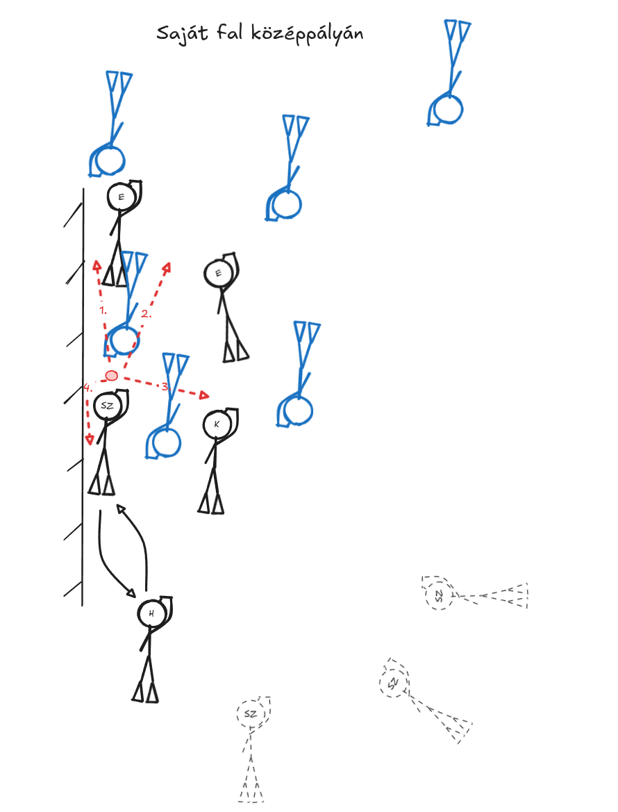
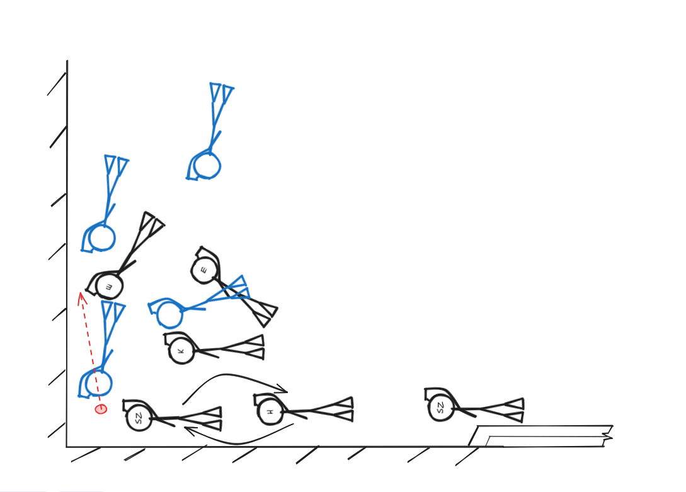
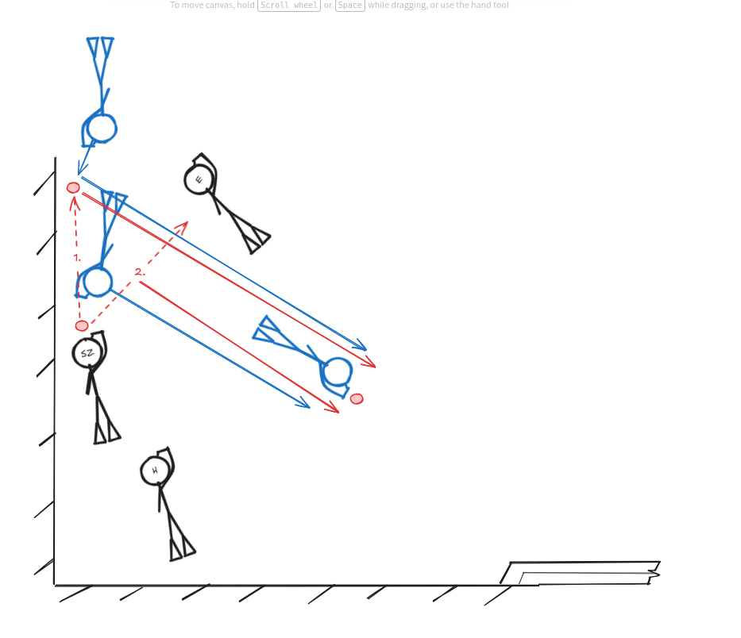
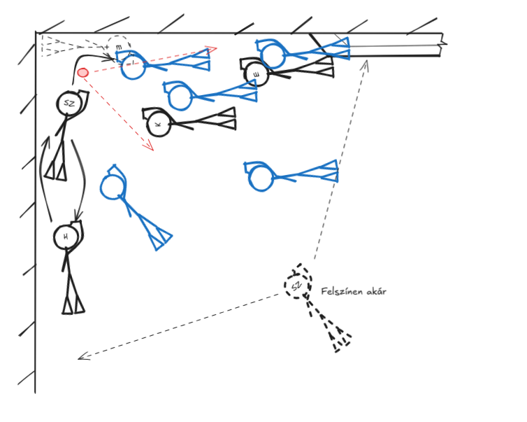

# A magyar 2-3-1

## Szélsők

### A szélső pozícióról általánosan

2-3-1-es felállásban a középső sor szélén lévő két játékost hívjuk bal és jobb szélsőnek.
A pozíció nagyon sokrétű tudást igényel, másodpercek alatt lehet utolsó védőből és góllövő befejező az ember.
Bár a mi rendszerünkben eléggé megkötött a pozíciójuk, de nagyon fontos, hogy ezen belül precízen helyezkedjen a játékos.
Technikailag a legfontosabbak az alapok: fordulás, jobbról és balról szerelés, lövés, passzátvétel - egy aránylag egyszerű repertoárral már nagyon eredményes szélső lehet valaki.
Fizikailag fitnek és gyorsnak kell lenni. A magyar csapattal általában fix cserével (tehát 2 ember cseréli egymást egy pozícióra) játszuk a szélsőt,
így pár percenként megpihenhet a játékos, de a bentlét alatt emiatt sok munkát kell végeznie.

### Aranyszabályok

A szélsők helyezkedését és döntéseit az esetek 99%-ban a következő szabályok határozzák meg:

1. Mindig a korong vonala mögé helyzkedj!
2. Ne kerülj a középső túloldalára!
3. A saját oldalad felé sosem kerülhetnek meg (jobb szélsőt jobbra, balra szélsőt balra ne ússzon körbe ellenfél)!
4. Próbáld az ellenfél szélső emberét kívűlről kerülni - ne törj befelé!
5. Ne irányíts, csak akkor passzolj a szélsőnek és hátsónak, ha látod, hogy kérik a korongot!
6. Ha lehetőséged van (és általában van), akkor vidd a korongot a saját oldalad felé!
7. Ha a tulsó oldalra besegítesz védekezni, akkor
  1. biztosítsd a korongot,
  2. a lehető leggyorsabban (teljes biztonság mellett) add át a hátsónak vagy tulsó szélsőnek,
  3. sprintelj vissza a saját széledre, amilyen gyorsan csak tudsz!

Ha valaki ezeket megjegyzi, akkor a játék közben felmerülő szinte összes szélsőt érintő kérdésre választ kap!

### Szituációk

#### Ráúszás

Ráuszáskor a szélsők valamivel az első mögött, 0.5-1 méterre oldalra a középsőtől helyezkednek el.
Arra kell koncentrálniuk, hogy bármerre is megy tovább a korong, a közelben tudjanak maradni és segíteni a csapatnak.
Mivel mindkét csapatból sok ember lent van, így [statikus játékszituációról](#statikus-játékszituáció) beszélhetünk, fontos, hogy amíg nem tisztázódott le a helyzet, addig elég közel legyen ahhoz, hogy játékba tudjanak avatkozni.

[Egy jó példa a szélső kihozatalra](https://youtube.com/clip/UgkxManUw2g3OnkR6l0SkiYl1RvGzL_bAHcn?si=fbLAnucn3kHkSWms) a 2004-es VB elődöntőből. Az első ráúszást követően a szélső visszafordult szinte teljesen a saját kapuja felé és közben úgy helyezkedett a testével, hogy ki tudja "rántani" a korongot középről és rögtön tudjon a saját fala felé úszni vele (ahol egy első már sprintel elé).

<!-- Image sizing helper: use data-size="small|medium|large|full" on  -->

<!-- Ráúszás -->

__Korong oldalra megy__

3 nagyobb részre bonthatjuk azt az esetet, mikor a korong oldalra indul el:
1. nálunk van és az első tudott vele oldalra úszni,
2. nálunk van és a szélső tud vele úszni,
3. ellenfél hozza ki a szélre.

A 3. pontot ignoráljuk egyelőre, ilyenkor alapvetően a normál védekezésre van szükség.

__Korong szélsőhöz kerül és az tud a fal felé úszni__

A [közeli szélső](#közeli--távoli-szélső-jobb-elnevezésre-vár) célja ilyenkor - mint a fentebbi videóban is - hogy a korongot a fal mellé, a saját területére mentse ki.
Nagyon ritka az, hogy ilyenkor el tudjon szakadni az ellenféltől, általában az ellenfél külső játékosa - legyen az első vagy szélső - rögtön üldözőbe veszi a korongos játékost. Ilyenkor a szélsőnek sprintelnie kell a fal irányába, hogy megőrizze a korongot, és közben keresnie kell a lehetőséget, hogy az ellenfél __külső__ oldalán passzoljon az előtte lévő csapattársnak.

Ha már elindult a közeli szélső a koronggal és láthatólag nem fogják szerelni, akkor a távoli szélső feljöhet a felszínre.

__Korongot az első viszi ki a oldalra__

Ha a korongot az első szerzi meg és kezd vele a szélre úszni, akkor a közeli szélsőnek mögötte kell mozognia - legideálisabb, ha nem tökéletesen mögötte, hanem egy nagyon kicsit a fal felé eltolódva (20-30 cm). Általában az szokott történni, hogy az elsőt a tulsó oldali szélső egy idő után megtámadja és már nem tud egyedül effektíven tovább haladni. Ilyenkor egy jó megoldás lehet, hogy hátrapasszolja a közeli szélsőnek a korongot és átúszik a védő túloldalára, a szélső pedig belövi az ellenfél mögé a korongot.

__Fontos__, hogy mindkét esetben próbáljon meg a szélső már a fal előtt 1 méterrel "kiegyenesedni" az ellenfél kapuja felé, mert ezzel megadja a lehetőséget az elsőknek, hogy az ellenfél külső (fal felöli) oldalán kapjanak passzt.

A távoli szélső feljöhet a felszínre, ha a korong egyértelműen kiér a falra.

#### Középpálya fal

__Helyezkedés, forgás__

A standard forgás a falon a közeli szélső és a hátsó között folyik. Ideális esetben a középsőnek nem kell ide beforognia.

__Cél - statikus játék__

Ha a falon ragadnak a csapatok, akkor egy statikusabb játék alakul ki. Ilyenkor az ellenfél helyezkedése függvényében több dolgot is megpróbálhat a csapat: megpróbálni haladni a falon vagy lenyitni róla.

A szélsőknek ilyenkor figyelnie kell a kialakuló játékszituációt, illetve a középső és hátsó helyezkedését.

__Közeli (fal) szélső__

Ha a közeli szélsőhöz kerül a falon a korong, akkor négy passz közül választhat a helyzettől függően.

- Az ábrán 1. és 2. számú passzok akkor működnek a legjobban, ha lent van mind a két elsőnk. A szélsőnek ilyenkor meg kell próbálnia __irányítani a passzal__, olyan helyre adni a korongot, hogy azzal jelezze az elsőknek, hogy merre tudnak azzal haladni. Általában akkor van lehetőség passzra (és nem csak a falon tunkolásra), ha pl. már forgott a csapat egyet a falon és a leghátsó befordult a szélső előtt és visszaadta a korongot.
- A 3. számú passz általában csak egy test alatti suttyomban áttolást jelent, amikor nagyon összesűrűsödik a játék a falon. Ilyenkor a középső néha megpróbál kiváltani a jobb szélre vagy hátsónak, de gyakrabban nincs erre helye/lehetőség, így csak előrefelé próbál törni kicsi cselekkel. Mivel utóbbi esetben könnyen leüti a sok ellenfél a középső kezéről a korongot, ezért sokat számít, hogy a szélső lent marad-e még pár másodpercig és megpróbálja kísérni a középsőt. __A 3. számú passzt ezért ne utolsó lehelletével adja a szélső, hanem akkor, amikor még lent tud maradni.__
- A 4. passz, amikor befordul a falon a szélső és hátrajátsza a korongot a hátsónak. Itt a hátsó pozíciójára kell figyelnie, hogy hova kéri a korongot:
  - Nagyon közel van? Csak ott kell hagyni, a falon fog továbbmenni ő is.
  - Helyet hagyott, de a fal mentén? Közepes passz a fel mentén hátra.
  - A faltól 1 méterre helyezkedik, sok helyet hagyva? Le tudunk váltani, bal vagy jobb oldalára mehet a korong attól függően, hogy mit kér.

__Távoli szélső__

A játék körülményeitől függően (faljáték mennyire statikus, milyen a csapat kondija, mikor volt játékmegállítás, mennyire játszik szélesen az ellenfél, stb.) a távoli szélső helyezkedése nagyon változó lehet. A lényeg, hogy ellássa a következő 3 feladatot:

1. Az esetleges fal melletti ellenfél áttörést lezárja utolsó emberként.
2. Az ellenfél oldalváltását megfogja.
3. A saját oldalváltásunkra ott legyen, mikor a hátsó / középső passzolna neki.

Általában ilyenkor keveset kell lent töltenie, de annál fontosabb, hogy precízen helyezkedjen a víz felszínen és jól válassza meg a lejövetel időpontját. Fontos, hogy jól olvassa a játékot és megpróbálja előre kitalálni, hogy merre fog haladni a korong.

#### Védekező sarok

__Helyezkedés, forgás__

Amennyiben a sarokba kerül a korong és már rendeződött a játék, a hátfalon forgást a hátsó és falolaldi (közeli) szélső fogja csinálni, míg a távoli szélső csak biztosító szerepet folytat a kapu sarkánál.
Mivel ilyenkor a leg korlátozottabb a csapatok mozgása (két irányban is fal fogja a játékot), így gyakran alakul ki nagyon statikus játék, amikor 4 vagy 5 fő is lent van csapatonként. Ebben a helyzetben nagyon fontossá válik a pozícionálás a víz alatt, hiszen ha kitúrnak a megfelelő helyről, akkor azt hosszú időre is elveszíthetjük, mivel az "álldogálás" miatt mindenkinek több levegője lesz.

A __közeli szélső__ célja, hogy a fal mentén boxolással, vagy lövéssel kijutassa a korongot a sarokból. Leváltani ilyenkor rendkívűl veszélyes, hiszen egy jó betörés esetén pár uszonycsapás után a kapunk előtt lehet az ellenfél. Lőni csak akkor szabad a szélsőnek előre, ha nem lát lent ellenfél védőt és biztosan el tudja érni a saját lövését, vagy ha lent van egy első, aki a passzt biztosan fogadni tudja.

__Fontos__, hogy elsőnek való passz esetén ne lőjjük túl a korongot az elsőn (vagy lőjjük el első nélkül), mert így lehetőséget adunk az ellenfélnek, hogy rögtön leváltsanak a falról (1.-es passz az ábrán). Szintén lényeges, hogy a passz a fal mentén történjen, egy esetleges átlós passz esetén könnyen be tud törni az ellenfél játékosa, ha sikerül megakasztania út közben a korongot (2.-es passz az ábrán).

A távoli szélső a legutolsó védő szerepét tölti be, beforognia csak akkor kell a sarokba, ha valamiért a hátsó és a közeli szélső nem tudják megoldani a feladatot - elfáradtak, lejött a maszk, stb.- és nem marad elég védő a hátfalon. Szituációtól függően ilyenkor sokszor a középső fog beforogni, emiatt fontos, hogy figyelje leghátulról a játékot és megválassza a megfelelő időpontot a kisegítésre.

#### Támadó sarok

__Helyezkedés, forgás__

A saját sarokhoz hasonlóan itt is a faloldali / közeli szélső a hátsóval forog. Ha lelassul a játék, akkor hárman a faloldali elsővel elegek, hogy korongért küzdve elég nyomást kifejtsenek az oldal és hátfalra.

A távoli szélső szerepe - mint sok más szituációban - kettős, egyszerre utolsó védő és befejező támadó. Folyamatosan figyelnie kell, hogy merre mozog a korong és vagy elkapni a fal mentén az ellenfél kitörését, vagy a kapunál befejeznie az akciót.

__Cél__

A közeli szélsőnek haladnia kell a falon úgy, hogy ne nyomják fel, ne veszítse el a pozíciót. Ez lehet passzal az elsőnek, falon tolással vagy boxolással is, a lényeg, hogy lent legyen az alján. Az oldalfalon számíthat arra, hogy a hátsó ott lesz közvetlenül mögötte, a hátfalon pedig a faloldali első tud segíteni a nyomáshelyezésben. Ha nagyon el van akadva és fogytán a levegő, akkor be tud fordulni és leadni hátsónak a korongot. Amennyiben nagyon sok embert lát a hátfalon és szabadabban marad a középső túloldala, akkor adhat passzt még a középső faltól távolabbi oldalára is.

A távoli szélsőnek olvasnia kell a játékot és ahhoz mérten helyezkedni, hogy várhatóan merre fog továbbmenni a következő pár másodpercben. A legfontosabb feladata természetesen, hogy levédekezze az esetleg ellenfél megúszást, ám nem teheti meg, hogy beáll védekezni a falra a hátsó mögé, hiszen az esetek egy jelentős részében ő lesz a befejező ember a kapunál.

### Szószedet

#### Közeli / távoli szélső (jobb elnevezésre vár)

Ha bal fal közelében megy a játék, akkor a bal szélső a _közeli_ és a jobb szélső a _távoli_.
Ha jobb fal közelében megy a játék, akkor a jobb szélső a _közeli_ és a bal szélső a _távoli_.

#### Statikus játékszituáció

Statikus a játékszituáció, ha a következő dolgok jellemzőek rá:
1) 5-6 ember lent van csapatonként (falon 3-4),
2) a korongot áll, lassan mozog, vagy épp több játékos között pattog kicsi területen,
3) az elmúlt 10 másodpercben nem volt sok úszás,
4) rendezettebbek a csapatok.

Ilyenkor általában többet számít, hogy az egyes csapatok hány embert tudnak a korong közelébe juttatni és így csapatként "terelni" a korongot.
A játékosoknál előtérbe kerül, hogy mennyire tudnak a medence alján helyezkedni, mennyire erősek fizikálisan.
Amennyiben térben megfelelően helyezkedik egymáshoz képest a csapat, úgy rengeteg energiát meg lehet azzal spórolni, hogy nem kell forgolódnia az embereknek: pl. leütik a kezemről a korongot, de nem kell hátrafordulnom érte, mert tudom, hogy ott egy társam, aki vissza tudja adni elém rögtön.

#### Dinamikus játékszituáció

Statikus a játékszituáció, ha a következő dolgok jellemzőek rá:
1) max 2-3 ember lent van csapatonként,
2) a korongot mozgásban van,
3) az elmúlt 10-15 sokat mozgott a korong, mozgásban van a legtöbb játékos,
4) rendezetlenebbek a csapatok.

Ilyenkor általában többet számít a sebesség és az egyéni korongozás, mivel 1v1 és 2v2-es szituációk alakul(hat)nak ki.
